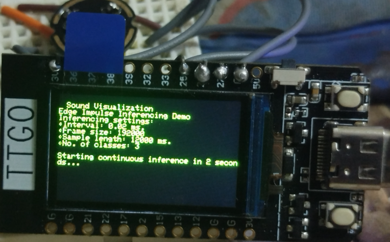
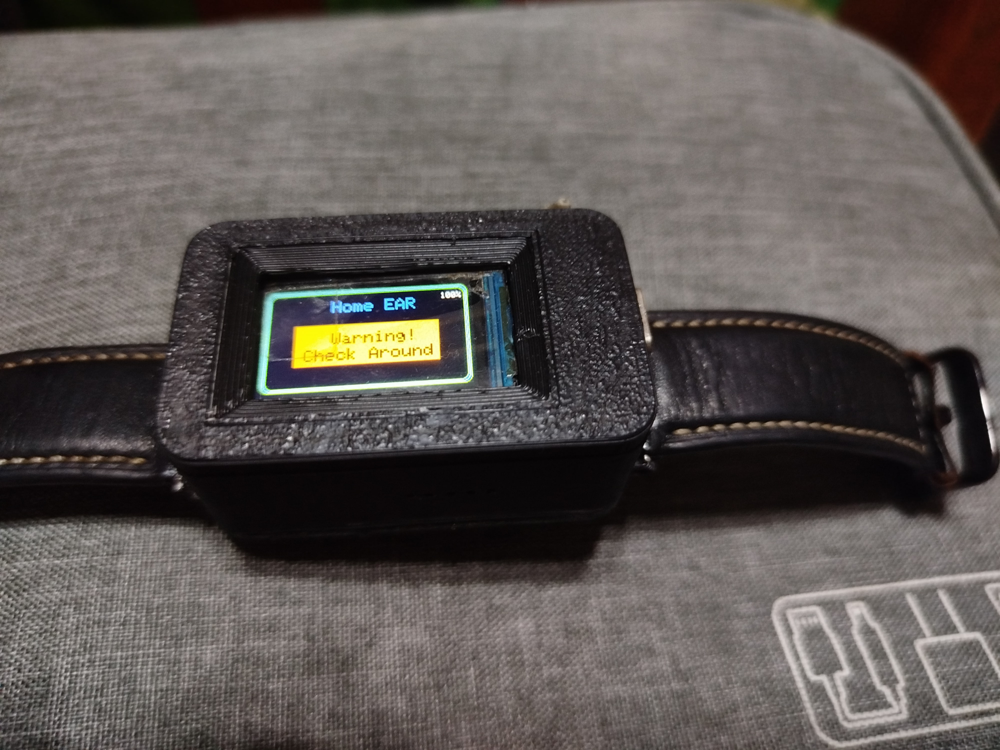
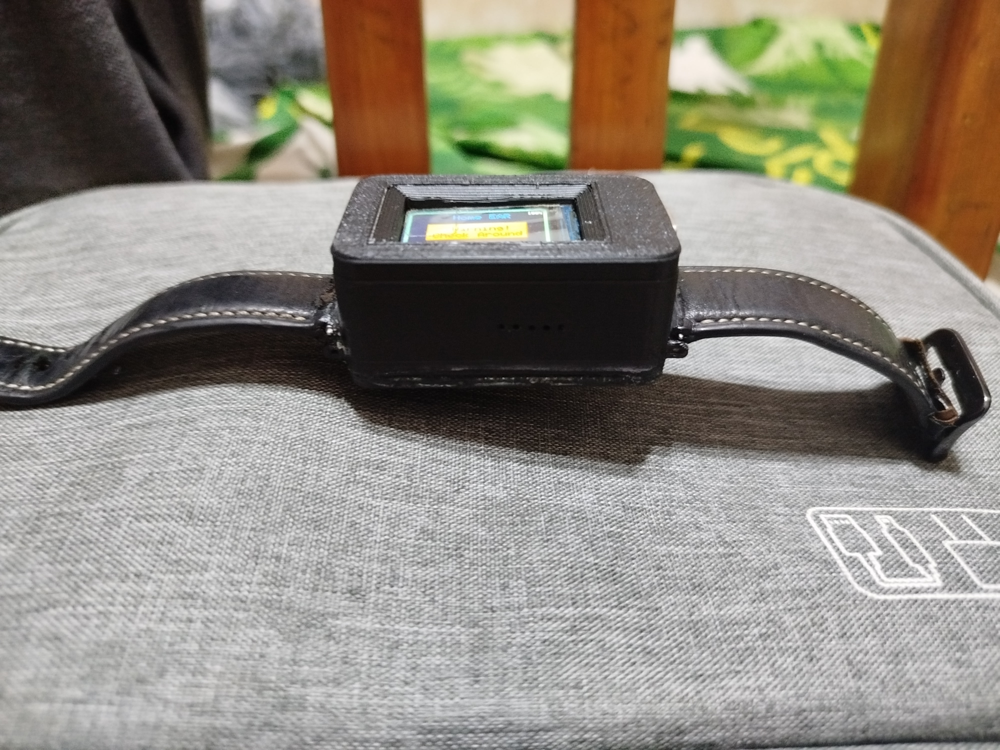
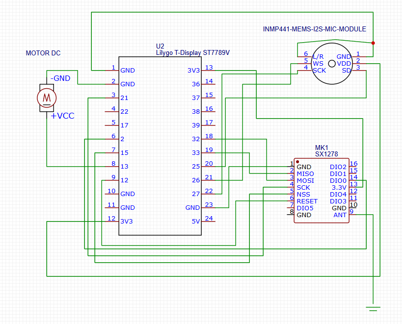

# 🦻 Home Ear TinyML – Sub Device
Welcome to the official repository of Home Ear TinyML – Sub Device, the wearable component of the Home Ear system. This intelligent device empowers deaf and hard-of-hearing users with real-time, non-auditory alerts by utilizing embedded machine learning and wireless communication.

🔮 What is Home Ear – Sub Device?
The Sub Device is a wearable wristwatch-like companion designed to receive and interpret alerts from the main Home Ear device. It uses TinyML, wireless modules (LoRa/BLE/Wi-Fi), LED indicators, haptic feedback, and visual displays to provide context-aware notifications based on sound detection (e.g., fire alarm, school bell, car horn).

🧠 Features
📡 Wireless Communication – Connects to the main Home Ear unit via LoRa

🧠 TinyML Sound Categorization – Classifies alerts like alarms, bells, or emergencies

💡 LED & Display Indicators – Shows color-coded or image-based alerts

🔔 Vibration Feedback – Distinct vibration patterns per sound type

🔋 Battery Powered – Designed for long-term wearable use

🧱 Compact Design – Built for wrist-based or clip-on wearable form factors

⚙️ Hardware Components
ESP32 TTGO T-Display 1.14 inch 

INMP441 I2S Microphone (only in standalone models)

SX1278 LoRa module (optional)

Coin vibration motor

LiPo Battery (700–2000mAh)

Power management circuit

# 🔧 Step-by-Step Installation: Arduino IDE for ESP32 TTGO
🧱 Step 1: Install Arduino IDE
If you haven’t already, download and install the latest Arduino IDE:

🔗 https://www.arduino.cc/en/software

I recommend Arduino IDE 2.x for a smoother, modern experience — unless you prefer the classic v1.x look of the old world.

🔥 Step 2: Add ESP32 Board Support to Arduino
Open Arduino IDE

Go to File → Preferences

In the “Additional Board Manager URLs”, paste the following:

https://raw.githubusercontent.com/espressif/arduino-esp32/gh-pages/package_esp32_index.json

🧙‍♂️ Step 3: Install the ESP32 Boards
Go to Tools → Board → Board Manager

Search for “ESP32 by Espressif Systems”

Click Install

This installs all ESP32 board definitions including the TTGO T-Display, T-Beam, T-Watch, and other fiendishly cool modules.

⌚ Step 4: Select Your TTGO Board
Now you must select the correct TTGO variant. Go to:

Tools → Board → ESP32 Arduino

Select:
TTGO LoRa32-OLED V1 or
TTGO T-Display or whichever applies to your model
(e.g., T-Watch, T-Camera, etc.)

If you don't see the exact TTGO version, install this additional library:

Go to Sketch → Include Library → Manage Libraries

Search TTGO

Install relevant ones:

TFT_eSPI (for display)

LoRa (for LoRa boards)

TinyML or TensorFlow Lite Micro (if using inference)

# 🧠 Machine Learning Model
TinyML model trained on **EDGE IMPULSE**

Deployed via TensorFlow Lite Micro (if applicable)

Capable of real-time inference on resource-limited devices

# 📜 License
This project is licensed under the MIT License – feel free to use, modify, and contribute. Just give proper attribution to the Dark Lord’s creation.

# 🤝 Contributing
Summon your pull requests and issues to this dark domain. Contributions, improvements, and demonic optimizations are most welcome.

# 💀 Author
Crafted with infernal dedication by **John Paul Dasig**

# 📸 Demo & Results

